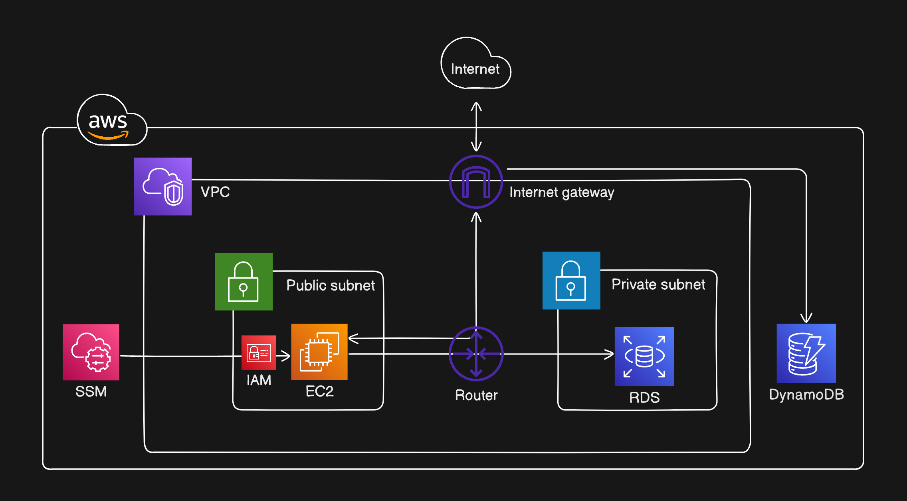

# Messenjo

Messenjo is a simple full-stack real-time messaging web application. It's built following (or trying to follow) the microservices pattern with a focus on low latency performance. The design of the backend might seem overcooked, I did this for learning purposes.

## Features

- OAuth 2.0 authentication (GitHub, Google)
- Add/remove friends
- Create/leave groups
- Change username and group name
- Add/change/remove user and group profile picture
- Real-time notifications
- Multi-device usage
- Lazy-loaded messages
- Dark mode

## Tech & Tools

- [Go] - A modern statically typed compiled programming language
- [TypeScript] - JavaScript with types
- [Docker] - A platform for running containers
- [Docker Compose] - A Docker plugin for running multi-container apps
- [NGINX] - An open source reverse proxy server
- [Certbot] - Automated free certificates from Let’s Encrypt
- [Node.js] - A JS runtime for the backend
- [pnpm] - A Node.js package manager, up to 2x faster than npm
- [Zod] - Type validator for JS and TS
- [Next.js] - The production-grade React framework
- [Tailwind CSS] - A utility-first CSS framework
- [µWebSockets.js] - A high-performance WebSocket framework for Node.js
- [esbuild] - An extremely fast JS and TS bundler
- [Buf] - A modern CLI tool for working with protocol buffers
- [gRPC] - A modern high-performance RPC framework
- [gRPC-web] - gRPC for web clients
- [Envoy] - A high-performance gRPC-web to gRPC proxy server
- [OAuth 2.0] - The industry-standard protocol for authorization
- [JWT] - A modern secure method for authentication
- [Garnet] - A high-performance Redis alternative from Microsoft
- [PostgreSQL] - An open source SQL database system
- [pgAdmin] - A GUI tool for working with PostgreSQL
- [migrate] - A CLI tool for doing database migrations
- [DynamoDB] - A fast serverless NoSQL service from AWS
- [GitHub Actions] - A CI/CD platform from GitHub
- [Terraform] - A tool for provisioning cloud infrastructure

## Architecture

## Data model

## Infrastructure

## Workflow

[Go]: https://go.dev/
[TypeScript]: https://www.typescriptlang.org/
[Docker]: https://www.docker.com/
[Docker Compose]: https://github.com/docker/compose
[NGINX]: https://nginx.org/en/
[Certbot]: https://certbot.eff.org/
[Node.js]: https://nodejs.org/
[pnpm]: https://pnpm.io/
[Zod]: https://zod.dev/
[Next.js]: https://nextjs.org/
[Tailwind CSS]: https://tailwindcss.com/
[µWebSockets.js]: https://github.com/uNetworking/uWebSockets.js
[esbuild]: https://esbuild.github.io/
[Buf]: https://buf.build/
[gRPC]: https://grpc.io/
[gRPC-web]: https://github.com/grpc/grpc-web
[Envoy]: https://www.envoyproxy.io/
[OAuth 2.0]: https://oauth.net/2/
[JWT]: https://jwt.io/
[Garnet]: https://microsoft.github.io/garnet/
[PostgreSQL]: https://www.postgresql.org/
[pgAdmin]: https://www.pgadmin.org/
[migrate]: https://github.com/golang-migrate/migrate
[DynamoDB]: https://aws.amazon.com/dynamodb/
[GitHub Actions]: https://github.com/features/actions
[Terraform]: https://www.terraform.io/
