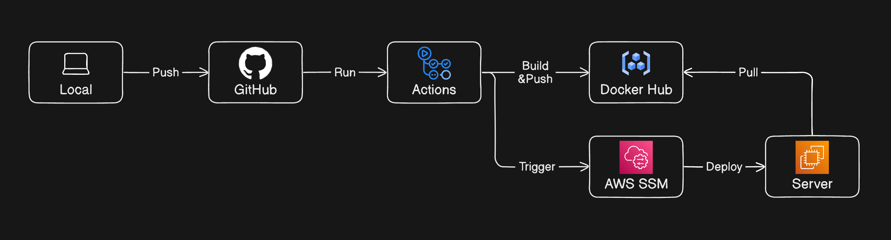

# Messenjo

Messenjo is a simple full-stack real-time messaging web application. It's built following (or trying to follow) the microservices pattern with a focus on low latency performance. The design of the backend might seem a bit overcooked, it was for learning purposes.

## Features

- OAuth 2.0 authentication (GitHub, Google)
- Add/remove friends
- Create/leave groups
- Send/read messages to friends/groups
- Change username and group name
- Add/change/remove user and group profile picture
- Real-time notifications
- Multi-device usage
- Lazy-loaded messages
- Dark mode

## Tech & Tools

- [Go](https://go.dev/) - A modern statically typed compiled programming language
- [TypeScript](https://www.typescriptlang.org/) - JavaScript with types
- [Docker](https://www.docker.com/) - A platform for running containers
- [Docker Compose](https://github.com/docker/compose) - A Docker plugin for running multi-container apps
- [NGINX](https://nginx.org/en/) - An open source reverse proxy server
- [Certbot](https://certbot.eff.org/) - Automated free certificates from Let’s Encrypt
- [Node.js](https://nodejs.org/) - A JS runtime for the backend
- [pnpm](https://pnpm.io/) - A Node.js package manager, up to 2x faster than npm
- [Zod](https://zod.dev/) - Type validator for JS and TS
- [Next.js](https://nextjs.org/) - The production-grade React framework
- [Tailwind CSS](https://tailwindcss.com/) - A utility-first CSS framework
- [µWebSockets.js](https://github.com/uNetworking/uWebSockets.js) - A high-performance WebSocket framework for Node.js
- [esbuild](https://esbuild.github.io/) - An extremely fast JS and TS bundler
- [Buf](https://buf.build/) - A modern CLI tool for working with protocol buffers
- [gRPC](https://grpc.io/) - A modern high-performance RPC framework
- [gRPC-web](https://github.com/grpc/grpc-web) - gRPC for web clients
- [Envoy](https://www.envoyproxy.io/) - A high-performance gRPC-web to gRPC proxy server
- [OAuth 2.0](https://oauth.net/2/) - The industry-standard protocol for authorization
- [JWT](https://jwt.io/) - A modern secure method for authentication
- [Garnet](https://microsoft.github.io/garnet/) - A high-performance Redis alternative from Microsoft
- [PostgreSQL](https://www.postgresql.org/) - An open source SQL database system
- [pgAdmin](https://www.pgadmin.org/) - A GUI tool for working with PostgreSQL
- [migrate](https://github.com/golang-migrate/migrate) - A CLI tool for doing database migrations
- [DynamoDB](https://aws.amazon.com/dynamodb/) - A fast serverless NoSQL service from AWS
- [GitHub Actions](https://github.com/features/actions) - A CI/CD platform from GitHub
- [Terraform](https://www.terraform.io/) - A tool for provisioning cloud infrastructure

## Architecture

## Data model

## Infrastructure

## CI/CD

### Appendix

- All the diagrams shown above were drawn using **[eraser.io](https://www.eraser.io/)** and **[dbdiagram.io](https://dbdiagram.io/)**
